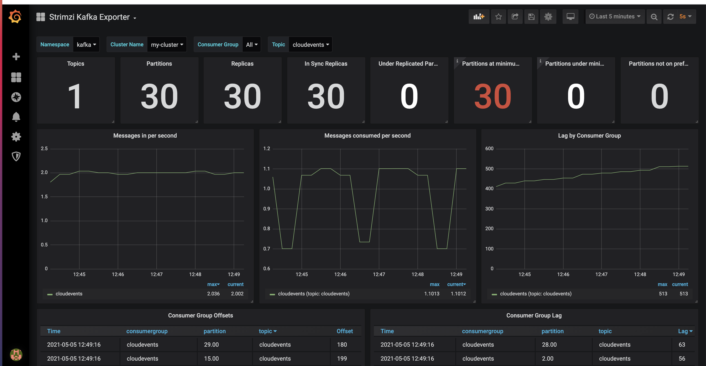

# Kubernetes Autoscaling

A good intro is [here](https://kubernetes.io/docs/tasks/run-application/horizontal-pod-autoscale-walkthrough/). 
Another good walkthrough (with pictures) is [here](https://learnk8s.io/autoscaling-apps-kubernetes). 
The complete e-2-e walkthrough for the implementation based on Prometheus adapter is [here](https://hackernoon.com/how-to-use-prometheus-adapter-to-autoscale-custom-metrics-deployments-p1p3tl0). 
An example for OpenShift can be found [here](https://docs.openshift.com/container-platform/4.1/monitoring/exposing-custom-application-metrics-for-autoscaling.html). 

Quick validation based on [this](https://blog.kloia.com/kubernetes-hpa-externalmetrics-prometheus-acb1d8a4ed50)

* Install kind. On Mac this is easy [using brew](https://kind.sigs.k8s.io/docs/user/quick-start/). Do not forget to set
[docker parameters](https://kind.sigs.k8s.io/docs/user/quick-start/#settings-for-docker-desktop) for it.
* Start kind cluster - `kind create cluster`
* Install metrics server. By default its not on kind. Also be aware that default metric server install is using secure communications, requiring a certificate.
To make it simpler, it supports insecure communications. I was following [instructions](https://computingforgeeks.com/how-to-deploy-metrics-server-to-kubernetes-cluster/)
  * Download manifest file from [here](https://github.com/kubernetes-sigs/metrics-server/releases/latest/download/components.yaml)
  * Modify it as [here](deployments/metricserver/components.yaml)
  * deploy it `kubectl apply -f <your location>components.yaml`  
  * verify that deployment is running `kubectl get deployment metrics-server -n kube-system`. Also verify that top command is working correctly `kubectl top nodes`
 
* Try HPA with default metrics:
  * Create ngnix deployment with this [file](deployments/default/ngnixdeployment.yaml) using `kubectl apply -f <your location>ngnixdeployment.yaml`. Make sure pods are running.
  * Create HPA with [this](deployments/default/hpa.yaml) using `kubectl apply -f <your location>hpa.yaml`  
  * To validate that it works run `kubectl get hpa`. Note that the amount of replicas is now 2.
  * Clean up. Run `kubectl delete deployment nginx-deployment` and `kubectl delete hpa nginx-cpu-hpa`  

* Try with custom metrics, follows this great writeup (https://github.com/kubernetes-sigs/prometheus-adapter/blob/master/docs/walkthrough.md):
  * Create sample app using [this yaml](deployments/custommetric/sample-app.yaml). Once deployed, access it by running `kubectl port-forward service/sample-app 8080:80` and acessing it at `http://localhost:8080/metric`
  * Install prometheus operator. I was following this [document](https://grafana.com/docs/grafana-cloud/quickstart/prometheus_operator/). 
    * First install operator bundle `kubectl apply -f https://raw.githubusercontent.com/prometheus-operator/prometheus-operator/master/bundle.yaml`
    * Configure Prometheus RBAC Permissions using [this yaml](deployments/custommetric/prometheus_rbac.yaml) by running `kubectl apply -f <your location>/prometheus_rbac.yaml`.
    * Create prometheus using [this yaml](deployments/custommetric/prometheus.yaml) by running `kubectl apply -f <your location>/prometheus.yaml`. Make sure that prometheus is created (`kubectl get prometheus`) pods are running.
    * Create a Prometheus Service using [this yaml](deployments/custommetric/prometheus_service.yaml) by running `kubectl apply -f <your location>/prometheus_service.yaml`. To access the service run `kubectl port-forward svc/prometheus 9090` and go to `http://localhost:9090/` to see UI
  * Create service monitor using [this yaml](deployments/custommetric/servicemonitor.yaml) by running `kubectl apply -f <your location>/servicemonitor.yaml`. With the monitor in place, go to Prometheus UI and you should see your metrics `http_requests_total`. You should see something like
    `http_requests_total{container="metrics-provider",endpoint="http",instance="10.244.0.16:8080",job="sample-app",namespace="default",pod="sample-app-7cfb596f98-pkv8t",service="sample-app"}	20`
  * Creating Prometheus Adapter done using Helm chart as described [here](https://github.com/prometheus-community/helm-charts/tree/main/charts/prometheus-adapter). Alternatively you can use yaml files located in [this directory](deployments/custommetric)
  * To verify that everything is installed correctly run `kubectl get --raw /apis/custom.metrics.k8s.io/v1beta1` and make sure that `"name":"pods/http_requests","singularName":"","namespaced":true,"kind":"MetricValueList","verbs":["get"]` is there.
  * Check the value of the metric `kubectl get --raw "/apis/custom.metrics.k8s.io/v1beta1/namespaces/default/pods/*/http_requests?selector=app%3Dsample-app"`
  * Create the HorizontalPodAutoscaler using [this yaml](deployments/custommetric/sample-app-hpa.yaml) by running `kubectl apply -f <your location>/sample-app-hpa.yaml`.
  * watch scaling

Additionally I tried to do the same on Minikube. The only difference there is that I did not have to install metric server manually.
It is part of Minikube addons and can be installed through [configuration](https://kubernetes.io/docs/tutorials/hello-minikube/)

## Using Kafka

One of the most common use cases for HPA on streaming applications is scaling based on the topic(s) lag.
Let`s install Kafka strimzi with Prometheus and see how put it all together.

Start by kind install, as described above and add metric server to it.

Now follow a great [article](https://snourian.com/kafka-kubernetes-strimzi-part-3-monitoring-strimzi-kafka-with-prometheus-grafana/)

Install Strimzi operator:
* Create ns - `kubectl create ns kafka`
* Add Helm repo -
````  
helm repo add strimzi https://strimzi.io/charts/
helm repo update
````  
* Install Strimzi operator with Helm
````
helm install strimzi strimzi/strimzi-kafka-operator --namespace kafka
````
Create Kafka cluster. [Definition](deployments/kafka/kafka-metrics.yaml) is cloned [from](https://github.com/strimzi/strimzi-kafka-operator/blob/0.21.1/examples/metrics/kafka-metrics.yaml).
Here, because we are running on Kind, we are using 1 zookeeper and 1 broker.
File has metrics key for both kafka and zookeeper, it also need to add [Kafka Exporter](https://strimzi.io/docs/operators/latest/deploying.html#proc-kafka-exporter-configuring-str) configs 
to enable [additional metrics](https://strimzi.io/blog/2019/10/14/improving-prometheus-metrics/). To create cluster run:
````
kubectl apply -f <your location>/kafka-metrics.yaml -n kafka
````
More info on Kafka exporter configuration is [here](https://strimzi.io/docs/operators/latest/full/deploying.html#proc-kafka-exporter-configuring-str)
Detail description (along with installation chart) is [here](https://github.com/danielqsj/kafka_exporter)

Create namespace monitoring:

````
kubectl create ns monitoring
````
Now we can install Prometheus operator. To ensure that it is deployed to monitoring ns
we copied bundle [locally](deployments/kafka/bundle.yaml)
````
kubectl apply -f <your location>/bundle.yaml
````

Use [yaml](deployments/kafka/prometheus-additional.yaml) for additional scraping properties. Cloned from [here](https://github.com/strimzi/strimzi-kafka-operator/blob/0.21.1/examples/metrics/prometheus-additional-properties/prometheus-additional.yaml) to create secret:
````
kubectl apply -f <your location>/prometheus-additional.yaml -n monitoring
````
Create strimzi monitor using this [yaml](deployments/kafka/strimzi-pod-monitor.yaml) cloned from [here](https://github.com/strimzi/strimzi-kafka-operator/blob/0.21.1/examples/metrics/prometheus-install/strimzi-pod-monitor.yaml)
````
kubectl apply -f <your location>/strimzi-pod-monitor.yaml -n monitoring
````
Create prometheus using this [yaml](deployments/kafka/prometheus.yaml) cloned from [here](https://github.com/strimzi/strimzi-kafka-operator/blob/0.21.1/examples/metrics/prometheus-install/prometheus.yaml)
````
kubectl apply -f <your location>/prometheus.yaml -n monitoring
````
Install Grafana using this [yaml](deployments/kafka/grafana.yaml) cloned from [here](https://github.com/strimzi/strimzi-kafka-operator/blob/0.21.1/examples/metrics/grafana-install/grafana.yaml)
````
kubectl apply -f <your location>/grafana.yaml -n monitoring
````
Expose grafana using port-forward:
````
kubectl port-forward svc/grafana 3000:3000 -n monitoring
````
Now go to `localhost:3000` to get to UI. Default credentials are admin/admin.
Add Prometheus as a new Data Source. Inside the Settings tap, you need to enter Prometheus address - `http://prometheus-operated:9090` and validate that its
working. Add dashboards to see the results. We used 4 - cloned from [here](https://github.com/strimzi/strimzi-kafka-operator/tree/0.21.1/examples/metrics/grafana-dashboards)

Deploy Kafka consumer and producer:
````
kubectl apply -f <your location>/consumer.yaml
kubectl apply -f <your location>/producer.yaml
````

Deploy Kafka consumer and producer:
````
kubectl apply -f <your location>/consumer.yaml
kubectl apply -f <your location>/producer.yaml
````

Once consumer and producer are deployed, you can look at the grafana kafka exporter
dashboard, that shows speed of producing and consuming messages and the lag,
that can be used as an information for HPA


